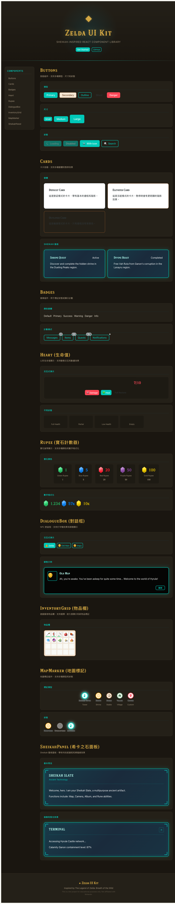

# Zelda UI Kit

A Sheikah-inspired React component library built with TypeScript and Less. Bring the look and feel of *The Legend of Zelda: Breath of the Wild* to your web apps.

> This is a fan project for educational purposes. Not affiliated with Nintendo.

---

## Demo

**[Live Demo](https://allenpan05.github.io/zelda-ui-kit/)**



---

## Install

```bash
npm install zelda-ui-kit
```

## Quick Start

```tsx
import { Button, Heart, Rupee, SheikahPanel, StaminaWheel } from 'zelda-ui-kit';
import 'zelda-ui-kit/dist/index.css';

function App() {
  return (
    <SheikahPanel title="Sheikah Slate">
      <Heart value={7} max={10} size="lg" animated />
      <Rupee value={1234} color="green" size="lg" />
      <StaminaWheel value={80} size="md" showValue />
      <Button type="primary">Explore Hyrule</Button>
    </SheikahPanel>
  );
}
```

---

## Components

### Basic UI

| Component | Description |
|---|---|
| **Button** | Primary, secondary, outline, ghost, danger variants |
| **Card** | Default, elevated, outlined, sheikah variants |
| **Badge** | Status badges with count and dot modes |
| **Input** | Text input with sheikah styling |
| **Select** | Dropdown select |
| **Checkbox** | Checkbox control |
| **Switch** | Toggle switch |
| **Tabs** | Tab navigation |
| **Tag** | Closable tags |
| **Tooltip** | Hover tooltips |
| **Modal** | Dialog overlay |
| **Progress** | Progress bar |
| **Loading** | Spinner |
| **Alert** | Inline alerts |
| **Divider** | Section divider |
| **Collapse** | Collapsible panels |

### Zelda Game Components

| Component | Description |
|---|---|
| **Heart** | Heart container health display with half-heart support and low-health pulse |
| **Rupee** | Gem currency counter with multi-layer gradient (green/blue/red/purple/gold) |
| **StaminaWheel** | Circular stamina gauge with low-warning animation |
| **DialogueBox** | NPC dialogue with typewriter effect and avatar |
| **InventoryGrid** | Game-style item grid with selection, durability bars, and new-item badges |
| **MapMarker** | Map pins (tower, shrine, stable, village) with discovered/undiscovered states |
| **SheikahPanel** | Sheikah Slate panel with corner decorations and scanline effect |
| **SheikahIcon** | Hylian Symbols icons (triforce, sheikah eye, zora, goron, gerudo, etc.) |
| **SheikahText** | Clip-path Sheikah alphabet rendering |
| **SelectionArrows** | Animated bounce arrows for selected items |
| **NotificationToast** | BOTW-style pickup/quest notification toasts |

---

## Design Tokens

All colors, spacing, and shadows are available as Less variables and CSS custom properties:

```less
// Colors
@zelda-primary: #00C8B8;      // Sheikah teal
@zelda-accent: #8B6914;       // Gold
@zelda-heart: #FF4757;        // Heart red
@zelda-rupee-green: #2ED573;  // Rupee green
@zelda-sheikah-bg: #1A2B3C;   // Panel dark

// Spacing
@space-xs: 4px;
@space-sm: 8px;
@space-md: 16px;
@space-lg: 24px;
@space-xl: 32px;

// Radius
@radius-sm: 4px;
@radius-md: 8px;
@radius-lg: 12px;
@radius-full: 9999px;
```

---

## Fonts

The library includes two custom fonts:

- **Hylia Serif** — Used for headings and game-style text
- **Hylian Symbols** — Zelda icon glyphs (triforce, sheikah eye, race crests)

Both are bundled in the build output.

---

## Tech Stack

- React 18+
- TypeScript
- Less
- Vite
- classnames

---

## Development

```bash
npm install
npm run dev          # Dev server at localhost:5173
npm run build        # Library build (ESM + CJS + CSS + types)
npm run build:demo   # Demo site build
```

---

## License

MIT

---

## Credits

- Inspired by *The Legend of Zelda: Breath of the Wild* (Nintendo)
- Hylia Serif font by [artsyomni](http://artsyomni.com/hyliaserif)
- Hylian Symbols font from [zeldauniverse.net](https://zeldauniverse.net/media/fonts/)
- Rupee and Sheikah CSS techniques from [gwannon/Zelda-breath-of-the-wild-theme-css](https://github.com/gwannon/Zelda-breath-of-the-wild-theme-css)
- Inventory UI patterns from [flagrede's BOTW tutorial](https://dev.to/flagrede/how-to-replicate-the-zelda-botw-interface-with-react-tailwind-and-framer-motion-part-1-298g)
